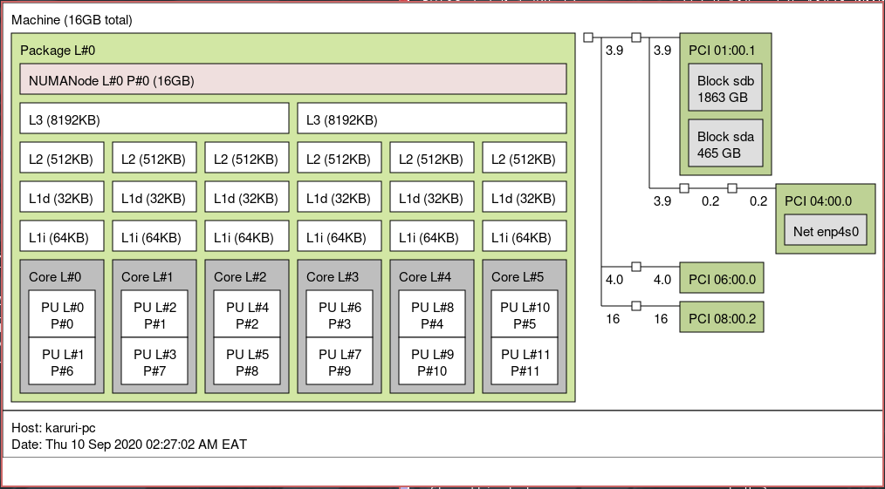
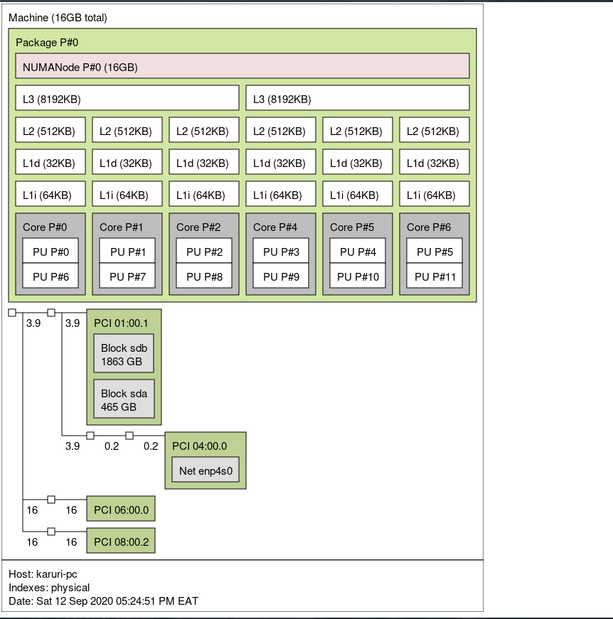
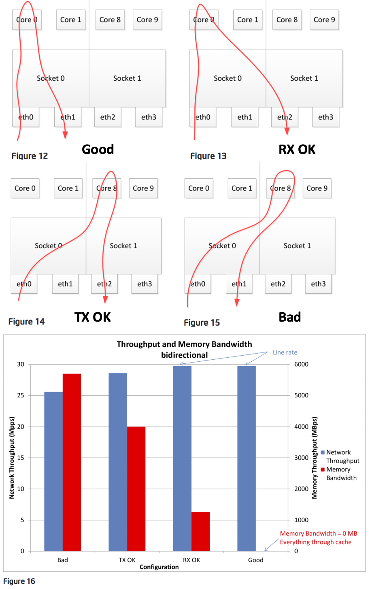
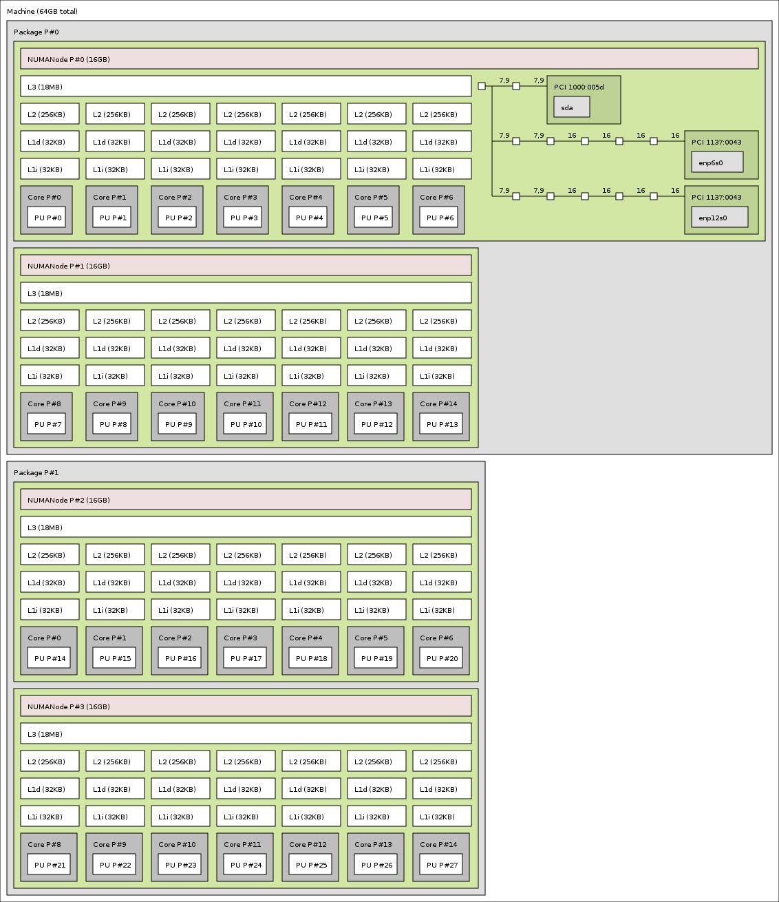

- [CPU Pinning Generic/VFIO](#cpu-pinning-genericvfio)
  - [CPU topology](#cpu-topology)
    - [Tools](#tools)
      - [lscpu (`util-linux` package)](#lscpu-util-linux-package)
        - [AMD example](#amd-examplesup1sup)
        - [Intel i7 example](#intel-i7-examplesup1sup)
        - [Intel Xeon example](#intel-xeon-example)
        - [Core 0 for the host!](#core-0-for-the-host)
      - [lstopo (`hwloc` package)](#lstopo-hwloc-package)
        - [Use Physical layout!](#use-physical-layout)
- [CPU Pinning for NICs (Sniffing / Sensoring)](#cpu-pinning-for-nics-sniffing-sensoring)
  - [NIC NUMA domain](#nic-numa-domainsup5sup)
  - [`lspci` PCI layout](#lspci-pci-layout)
    - [Example 1 (Single socket, Intel i7)](#example-1-single-socket-intel-i7)
    - [Example 2 (Quad socket, Intel Xeon)](#example-2-quad-socket-intel-xeon)
  - [`lstopo` PCI layout](#lstopo-pci-layout)
  - [Manual (via /sys) PCI layout](#manual-via-sys-pci-layout)
    - [Manual method example](#manual-method-example)

# CPU Pinning Generic/VFIO  
***This guide is related to VFIO and/or CPU pinning for NICs.***  


The default behavior for KVM guests is to run operations coming from the guest as a number of threads representing virtual processors. Those threads are managed by the Linux scheduler like any other thread and are dispatched to any available CPU cores based on niceness and priority queues. As such, the local CPU cache benefits (L1/L2) are lost each time the host scheduler reschedules the virtual CPU thread on a different physical CPU. This can noticeably harm performance on the guest. CPU pinning aims to resolve this by limiting which physical CPUs the virtual CPUs are allowed to run on. The ideal setup is a one to one mapping such that the virtual CPU cores match physical CPU cores while taking hyperthreading/SMT into account.<sup>[1]</sup>  
> **Note**: For certain users enabling CPU pinning may introduce stuttering and short hangs, especially with the MuQSS scheduler (present in linux-ck and linux-zen kernels). You might want to try disabling pinning first if you experience similar issues, which effectively trades maximum performance for responsiveness at all times.<sup>[1]</sup>  

It's very important that when we passthrough a core, we include its sibling.  A matching core id (i.e. "CORE" column) means that the associated threads (i.e. "CPU" column) run on the same physical core.<sup>[2]</sup>  

CPU pinning is a process where-in a vCPU is tied to a physical CPU core or thread. On systems with multiple NUMA nodes (which is often the case with multi-socket systems or multi-die processors) this prevents requests to/from memory (RAM) from having to cross Intels QPI link or AMDs Infinity Fabric to answer said request. The result is a noticeable performance boost under certain applications.<sup>[4]</sup>  
> **NOTE**: This is not the case for all systems/processors, in many instances the system will utilize UMA where there is only one CPU and one bank of memory. Do your research on your hardware. Now pinning the vCPUs on UMA systems won't hurt anything and if there's still anything to be had it may still be worth doing.<sup>[4]</sup>  

For example on a Ryzen Threadripper 1950X. This is a two die 16 core processor with two NUMA Nodes. Although the hardware knows this the BIOS manufacturers will frequently set a feature known as Memory Interleave to Auto. This creates an layer of abstraction which makes the NUMA nodes operate like a UMA Node. It's important to change this from Auto to Channel.<sup>[4]</sup> 

## CPU topology

Most modern CPUs support hardware multitasking, also known as hyper-threading on Intel CPUs or SMT on AMD CPUs. Hyper-threading/SMT is simply a very efficient way of running two threads on one CPU core at any given time. You will want to take into consideration that the CPU pinning you choose will greatly depend on what you do with your host while your VM or service(s) are running.<sup>[1]</sup>  

### Tools

#### lscpu (`util-linux` package)  
To find the topology for your CPU run **`lscpu -e`**  
> **Note**: Pay special attention to the 4th column "**CORE**" as this shows the association of the Physical/Logical CPU cores  


##### AMD example<sup>[1]</sup>
`lscpu -e` on a single socket 6c/12t Ryzen 5 1600: 
```bash
CPU NODE SOCKET CORE L1d:L1i:L2:L3 ONLINE MAXMHZ    MINMHZ
0   0    0      0    0:0:0:0       yes    3800.0000 1550.0000       # Core 0 sequential, on CPU 0 & CPU 1
1   0    0      0    0:0:0:0       yes    3800.0000 1550.0000       # Core 0 sequential, on CPU 0 & CPU 1
2   0    0      1    1:1:1:0       yes    3800.0000 1550.0000
3   0    0      1    1:1:1:0       yes    3800.0000 1550.0000
4   0    0      2    2:2:2:0       yes    3800.0000 1550.0000
5   0    0      2    2:2:2:0       yes    3800.0000 1550.0000
6   0    0      3    3:3:3:1       yes    3800.0000 1550.0000
7   0    0      3    3:3:3:1       yes    3800.0000 1550.0000
8   0    0      4    4:4:4:1       yes    3800.0000 1550.0000
9   0    0      4    4:4:4:1       yes    3800.0000 1550.0000
10  0    0      5    5:5:5:1       yes    3800.0000 1550.0000
11  0    0      5    5:5:5:1       yes    3800.0000 1550.0000
```

> **Note**: Ryzen 3000 ComboPi AGESA changes topology to match Intel example, even on prior generation CPUs. Above valid only on older AGESA. 

Notice that in the AMD case here, **AMD Core 0** is sequential with **CPU 0 & CPU 1**.  

##### Intel i7 example<sup>[1]</sup>
`lscpu -e` on a single socket 6c/12t Intel 8700k: 
```bash
CPU NODE SOCKET CORE L1d:L1i:L2:L3 ONLINE MAXMHZ    MINMHZ
0   0    0      0    0:0:0:0       yes    4600.0000 800.0000        # Core 0 non-sequential, on CPU 0 & CPU 6
1   0    0      1    1:1:1:0       yes    4600.0000 800.0000
2   0    0      2    2:2:2:0       yes    4600.0000 800.0000
3   0    0      3    3:3:3:0       yes    4600.0000 800.0000
4   0    0      4    4:4:4:0       yes    4600.0000 800.0000
5   0    0      5    5:5:5:0       yes    4600.0000 800.0000
6   0    0      0    0:0:0:0       yes    4600.0000 800.0000        # Core 0 non-sequential, on CPU 0 & CPU 6
7   0    0      1    1:1:1:0       yes    4600.0000 800.0000
8   0    0      2    2:2:2:0       yes    4600.0000 800.0000
9   0    0      3    3:3:3:0       yes    4600.0000 800.0000
10  0    0      4    4:4:4:0       yes    4600.0000 800.0000
11  0    0      5    5:5:5:0       yes    4600.0000 800.0000
```
Notice that in the Intel case here, **Intel Core 0** is on **CPU 0 & CPU 6**.  

##### Intel Xeon example
`lscpu` and `lscpu -e` on a Quad socket 8c/16t Xeon E5-4640:
```bash
# lscpu
CPU(s):                          64
On-line CPU(s) list:             0-63
Thread(s) per core:              2
Core(s) per socket:              8
Socket(s):                       4
NUMA node(s):                    4
NUMA node0 CPU(s):               0,4,8,12,16,20,24,28,32,36,40,44,48,52,56,60
NUMA node1 CPU(s):               1,5,9,13,17,21,25,29,33,37,41,45,49,53,57,61
NUMA node2 CPU(s):               2,6,10,14,18,22,26,30,34,38,42,46,50,54,58,62
NUMA node3 CPU(s):               3,7,11,15,19,23,27,31,35,39,43,47,51,55,59,63

# lscpu -e
CPU NODE SOCKET CORE L1d:L1i:L2:L3 ONLINE    MAXMHZ    MINMHZ
  0    0      0    0 0:0:0:0          yes 2800.0000 1200.0000		# Core 0 non-sequential, on Socket 0, CPU 0 & CPU 32
  1    1      1    1 1:1:1:1          yes 2800.0000 1200.0000
  2    2      2    2 2:2:2:2          yes 2800.0000 1200.0000
  3    3      3    3 3:3:3:3          yes 2800.0000 1200.0000
  4    0      0    4 4:4:4:0          yes 2800.0000 1200.0000
  5    1      1    5 5:5:5:1          yes 2800.0000 1200.0000
  6    2      2    6 6:6:6:2          yes 2800.0000 1200.0000
  7    3      3    7 7:7:7:3          yes 2800.0000 1200.0000
  8    0      0    8 8:8:8:0          yes 2800.0000 1200.0000
  9    1      1    9 9:9:9:1          yes 2800.0000 1200.0000
 10    2      2   10 10:10:10:2       yes 2800.0000 1200.0000
 11    3      3   11 11:11:11:3       yes 2800.0000 1200.0000
 12    0      0   12 12:12:12:0       yes 2800.0000 1200.0000
 13    1      1   13 13:13:13:1       yes 2800.0000 1200.0000
 14    2      2   14 14:14:14:2       yes 2800.0000 1200.0000
 15    3      3   15 15:15:15:3       yes 2800.0000 1200.0000
 16    0      0   16 16:16:16:0       yes 2800.0000 1200.0000
 17    1      1   17 17:17:17:1       yes 2800.0000 1200.0000
 18    2      2   18 18:18:18:2       yes 2800.0000 1200.0000
 19    3      3   19 19:19:19:3       yes 2800.0000 1200.0000
 20    0      0   20 20:20:20:0       yes 2800.0000 1200.0000
 21    1      1   21 21:21:21:1       yes 2800.0000 1200.0000
 22    2      2   22 22:22:22:2       yes 2800.0000 1200.0000
 23    3      3   23 23:23:23:3       yes 2800.0000 1200.0000
 24    0      0   24 24:24:24:0       yes 2800.0000 1200.0000
 25    1      1   25 25:25:25:1       yes 2800.0000 1200.0000
 26    2      2   26 26:26:26:2       yes 2800.0000 1200.0000
 27    3      3   27 27:27:27:3       yes 2800.0000 1200.0000
 28    0      0   28 28:28:28:0       yes 2800.0000 1200.0000
 29    1      1   29 29:29:29:1       yes 2800.0000 1200.0000
 30    2      2   30 30:30:30:2       yes 2800.0000 1200.0000
 31    3      3   31 31:31:31:3       yes 2800.0000 1200.0000
 32    0      0    0 0:0:0:0          yes 2800.0000 1200.0000		# Core 0 non-sequential, on Socket 0, CPU 0 & CPU 32
 33    1      1    1 1:1:1:1          yes 2800.0000 1200.0000
 34    2      2    2 2:2:2:2          yes 2800.0000 1200.0000
 35    3      3    3 3:3:3:3          yes 2800.0000 1200.0000
 36    0      0    4 4:4:4:0          yes 2800.0000 1200.0000
 37    1      1    5 5:5:5:1          yes 2800.0000 1200.0000
 38    2      2    6 6:6:6:2          yes 2800.0000 1200.0000
 39    3      3    7 7:7:7:3          yes 2800.0000 1200.0000
 40    0      0    8 8:8:8:0          yes 2800.0000 1200.0000
 41    1      1    9 9:9:9:1          yes 2800.0000 1200.0000
 42    2      2   10 10:10:10:2       yes 2800.0000 1200.0000
 43    3      3   11 11:11:11:3       yes 2800.0000 1200.0000
 44    0      0   12 12:12:12:0       yes 2800.0000 1200.0000
 45    1      1   13 13:13:13:1       yes 2800.0000 1200.0000
 46    2      2   14 14:14:14:2       yes 2800.0000 1200.0000
 47    3      3   15 15:15:15:3       yes 2800.0000 1200.0000
 48    0      0   16 16:16:16:0       yes 2800.0000 1200.0000
 49    1      1   17 17:17:17:1       yes 2800.0000 1200.0000
 50    2      2   18 18:18:18:2       yes 2800.0000 1200.0000
 51    3      3   19 19:19:19:3       yes 2800.0000 1200.0000
 52    0      0   20 20:20:20:0       yes 2800.0000 1200.0000
 53    1      1   21 21:21:21:1       yes 2800.0000 1200.0000
 54    2      2   22 22:22:22:2       yes 2800.0000 1200.0000
 55    3      3   23 23:23:23:3       yes 2800.0000 1200.0000
 56    0      0   24 24:24:24:0       yes 2800.0000 1200.0000
 57    1      1   25 25:25:25:1       yes 2800.0000 1200.0000
 58    2      2   26 26:26:26:2       yes 2800.0000 1200.0000
 59    3      3   27 27:27:27:3       yes 2800.0000 1200.0000
 60    0      0   28 28:28:28:0       yes 2800.0000 1200.0000
 61    1      1   29 29:29:29:1       yes 2800.0000 1200.0000
 62    2      2   30 30:30:30:2       yes 2800.0000 1200.0000
 63    3      3   31 31:31:31:3       yes 2800.0000 1200.0000
```


##### Core 0 for the host!  
> If you do not need all cores for the guest, it would then be preferable to leave at the very least one core for the host. Choosing which cores one to use for the host or guest should be based on the specific hardware characteristics of your CPU, however **Core 0** is a good choice for the host in most cases. If any cores are reserved for the host, it is recommended to pin the emulator and iothreads, if used, to the host cores rather than the VCPUs. This may improve performance and reduce latency for the guest since those threads will not pollute the cache or contend for scheduling with the guest VCPU threads. For VFIO, if all cores are passed to the guest, there is no need or benefit to pinning the emulator or iothreads.<sup>[1]</sup> 

#### lstopo (`hwloc` package)  
The package `hwloc` can visually show you the topology of your CPU.<sup>[2]</sup>  
To find the topology for your CPU run **`lstopo`** for a graphical window or **`lstopo --of txt`** for a CLI picture<sup>[2]</sup>  

  

The format above can be a bit confusing due to the default display mode of the indexes.  
##### Use Physical layout!  
Toggle the display mode using **`i`** until the legend (at the bottom) shows "**Indexes: Physical**". The layout should become more clear. In my case it becomes this:<sup>[2]</sup>

  

To explain a little bit, I have 6 physical cores (Core P#0 to P#6) and 12 virtual cores (PU P#0 to PU P#11). The 6 physical cores are mainly divided into two sets of 3 cores: Core P#0 to P#2; and Core P#4 to P#6. Each group has its own L3 cache. However, the most important thing to pay attention here is how virtual cores are mapped to the physical core. The virtual cores (notated PU P#...) come in pairs of two i.e. siblings:<sup>[2]</sup>

*  PU P#0 and PU P#6 are siblings in Core P#0
*  PU P#1 and PU P#7 are siblings in Core P#1
*  PU P#2 and PU P#8 are siblings in Core P#3


# CPU Pinning for NICs (Sniffing / Sensoring)  

## NIC NUMA domain<sup>[5]</sup>  
Accessing NIC in the same NUMA domain is faster than across NUMA domain<sup>[6]</sup>.  Example:
  
In summary, always use cores with NIC within the same NUMA node if possible to gain best performance when pinning CPUs.  

## `lspci` PCI layout  
The command `lspci -vnn` can be used to display which NUMA Node a PCI device (GPU, NIC, etc) is connected to. Just search for the Device ID or Device Address. It will list (or help to find) the NUMA Node.  

### Example 1 (Single socket, Intel i7)  
In this case, **no NUMA node is shown** on the Ethernet controller, because there is only one NUMA.
```bash
# sudo lspci -vnn
...
00:1f.6 Ethernet controller [0200]: Intel Corporation Ethernet Connection (2) I219-V [8086:15b8]
	Subsystem: Micro-Star International Co., Ltd. [MSI] Device [1462:7a66]
	Flags: bus master, fast devsel, latency 0, IRQ 137, IOMMU group 11
	Memory at df300000 (32-bit, non-prefetchable) [size=128K]
	Capabilities: [c8] Power Management version 3
	Capabilities: [d0] MSI: Enable+ Count=1/1 Maskable- 64bit+
	Capabilities: [e0] PCI Advanced Features
	Kernel driver in use: e1000e
	Kernel modules: e1000e

01:00.0 VGA compatible controller [0300]: NVIDIA Corporation GP104 [GeForce GTX 1080] [10de:1b80] (rev a1) (prog-if 00 [VGA controller])
	Subsystem: Gigabyte Technology Co., Ltd Device [1458:3702]
	Flags: bus master, fast devsel, latency 0, IRQ 140, IOMMU group 1
	Memory at de000000 (32-bit, non-prefetchable) [size=16M]
	Memory at c0000000 (64-bit, prefetchable) [size=256M]
	Memory at d0000000 (64-bit, prefetchable) [size=32M]
	I/O ports at e000 [size=128]
	Expansion ROM at 000c0000 [virtual] [disabled] [size=128K]
	Capabilities: [60] Power Management version 3
	Capabilities: [68] MSI: Enable+ Count=1/1 Maskable- 64bit+
	Capabilities: [78] Express Legacy Endpoint, MSI 00
	Capabilities: [100] Virtual Channel
	Capabilities: [250] Latency Tolerance Reporting
	Capabilities: [128] Power Budgeting <?>
	Capabilities: [420] Advanced Error Reporting
	Capabilities: [600] Vendor Specific Information: ID=0001 Rev=1 Len=024 <?>
	Capabilities: [900] Secondary PCI Express
	Kernel driver in use: nvidia
	Kernel modules: nouveau, nvidia_drm, nvidia

01:00.1 Audio device [0403]: NVIDIA Corporation GP104 High Definition Audio Controller [10de:10f0] (rev a1)
	Subsystem: Gigabyte Technology Co., Ltd Device [1458:3702]
	Flags: bus master, fast devsel, latency 0, IRQ 17, IOMMU group 1
	Memory at df080000 (32-bit, non-prefetchable) [size=16K]
	Capabilities: [60] Power Management version 3
	Capabilities: [68] MSI: Enable- Count=1/1 Maskable- 64bit+
	Capabilities: [78] Express Endpoint, MSI 00
	Capabilities: [100] Advanced Error Reporting
	Kernel driver in use: snd_hda_intel
	Kernel modules: snd_hda_intel
...
```

### Example 2 (Quad socket, Intel Xeon)  
This time there is multiple NUMA nodes and so it **will show** the NUMA node when running `lspci -vnn`  
```bash
# sudo lspci -vnn
...
01:00.0 Ethernet controller [0200]: Broadcom Inc. and subsidiaries NetXtreme BCM5720 2-port Gigabit Ethernet PCIe [14e4:165f]
	DeviceName: NIC1
	Subsystem: Dell Device [1028:1f5b]
	Flags: bus master, fast devsel, latency 0, IRQ 59, NUMA node 0		# <-- NUMA Node 0
	Memory at d91a0000 (64-bit, prefetchable) [size=64K]
	Memory at d91b0000 (64-bit, prefetchable) [size=64K]
	Memory at d91c0000 (64-bit, prefetchable) [size=64K]
	Expansion ROM at dc800000 [disabled] [size=256K]
	Capabilities: [48] Power Management version 3
	Capabilities: [50] Vital Product Data
	Capabilities: [58] MSI: Enable- Count=1/8 Maskable- 64bit+
	Capabilities: [a0] MSI-X: Enable+ Count=17 Masked-
	Capabilities: [ac] Express Endpoint, MSI 00
	Capabilities: [100] Advanced Error Reporting
	Capabilities: [13c] Device Serial Number 00-00-90-b1-1c-09-fd-62
	Capabilities: [150] Power Budgeting <?>
	Capabilities: [160] Virtual Channel
	Kernel driver in use: tg3
	Kernel modules: tg3

01:00.1 Ethernet controller [0200]: Broadcom Inc. and subsidiaries NetXtreme BCM5720 2-port Gigabit Ethernet PCIe [14e4:165f]
	DeviceName: NIC2
	Subsystem: Dell Device [1028:1f5b]
	Flags: bus master, fast devsel, latency 0, IRQ 60, NUMA node 0		# <-- NUMA Node 0
	Memory at d91d0000 (64-bit, prefetchable) [size=64K]
	Memory at d91e0000 (64-bit, prefetchable) [size=64K]
	Memory at d91f0000 (64-bit, prefetchable) [size=64K]
	Expansion ROM at dc840000 [disabled] [size=256K]
	Capabilities: [48] Power Management version 3
	Capabilities: [50] Vital Product Data
	Capabilities: [58] MSI: Enable- Count=1/8 Maskable- 64bit+
	Capabilities: [a0] MSI-X: Enable+ Count=17 Masked-
	Capabilities: [ac] Express Endpoint, MSI 00
	Capabilities: [100] Advanced Error Reporting
	Capabilities: [13c] Device Serial Number 00-00-90-b1-1c-09-fd-63
	Capabilities: [150] Power Budgeting <?>
	Capabilities: [160] Virtual Channel
	Kernel driver in use: tg3
	Kernel modules: tg3

02:00.0 Ethernet controller [0200]: Broadcom Inc. and subsidiaries NetXtreme BCM5720 2-port Gigabit Ethernet PCIe [14e4:165f]
	DeviceName: NIC3
	Subsystem: Dell Device [1028:1f5b]
	Flags: bus master, fast devsel, latency 0, IRQ 61, NUMA node 0		# <-- NUMA Node 0
	Memory at d90a0000 (64-bit, prefetchable) [size=64K]
	Memory at d90b0000 (64-bit, prefetchable) [size=64K]
	Memory at d90c0000 (64-bit, prefetchable) [size=64K]
	Expansion ROM at dc000000 [disabled] [size=256K]
	Capabilities: [48] Power Management version 3
	Capabilities: [50] Vital Product Data
	Capabilities: [58] MSI: Enable- Count=1/8 Maskable- 64bit+
	Capabilities: [a0] MSI-X: Enable+ Count=17 Masked-
	Capabilities: [ac] Express Endpoint, MSI 00
	Capabilities: [100] Advanced Error Reporting
	Capabilities: [13c] Device Serial Number 00-00-90-b1-1c-09-fd-64
	Capabilities: [150] Power Budgeting <?>
	Capabilities: [160] Virtual Channel
	Kernel driver in use: tg3
	Kernel modules: tg3

02:00.1 Ethernet controller [0200]: Broadcom Inc. and subsidiaries NetXtreme BCM5720 2-port Gigabit Ethernet PCIe [14e4:165f]
	DeviceName: NIC4
	Subsystem: Dell Device [1028:1f5b]
	Flags: bus master, fast devsel, latency 0, IRQ 62, NUMA node 0		# <-- NUMA Node 0
	Memory at d90d0000 (64-bit, prefetchable) [size=64K]
	Memory at d90e0000 (64-bit, prefetchable) [size=64K]
	Memory at d90f0000 (64-bit, prefetchable) [size=64K]
	Expansion ROM at dc040000 [disabled] [size=256K]
	Capabilities: [48] Power Management version 3
	Capabilities: [50] Vital Product Data
	Capabilities: [58] MSI: Enable- Count=1/8 Maskable- 64bit+
	Capabilities: [a0] MSI-X: Enable+ Count=17 Masked-
	Capabilities: [ac] Express Endpoint, MSI 00
	Capabilities: [100] Advanced Error Reporting
	Capabilities: [13c] Device Serial Number 00-00-90-b1-1c-09-fd-65
	Capabilities: [150] Power Budgeting <?>
	Capabilities: [160] Virtual Channel
	Kernel driver in use: tg3
	Kernel modules: tg3
...
```

## `lstopo` PCI layout  

In a multi-NUMA layout, its easier to identify which NUMA the NIC is tied to:  
Using a `lstopo` output from [Open MPI,Xeon](https://www.open-mpi.org/projects/hwloc/lstopo/images/2XeonE5v3.v1.11.png):  
> 2x Xeon Haswell-EP E5-2683v3 (from 2014, with hwloc v1.11).
> Processors are configured in Cluster-on-Die mode which shows 2 NUMA nodes per package
  

This picture shows that NUMA 0, Core P0 - P6 are where the NIC resides.  


## Manual (via /sys) PCI layout  
Manually go to `/sys/class/net/{DEVICE}/device/`.  
*  Replace {DEVICE} with your NIC name from `ip link` command (example: eth0, eno1, enp0s31f6).  

Or

Manually go to `/sys/bus/pci/devices/0000:{DEVICE_ID}/`.  
*  Replace {DEVICE_ID} with the DEVICE_ID identified via `lspci -vnn` (example: 00:1f.6, 01:00.0).  

A listing of files at this path will be:  

```
ari_enabled               dma_mask_bits    irq            net          reset             uevent
broken_parity_status      driver           link           numa_node    resource          vendor
class                     driver_override  local_cpulist  power        resource0         wakeup
config                    enable           local_cpus     power_state  revision
consistent_dma_mask_bits  firmware_node    modalias       ptp          subsystem
d3cold_allowed            iommu            msi_bus        remove       subsystem_device
device                    iommu_group      msi_irqs       rescan       subsystem_vendor
```
`numa_node` *might* show the numa node connected, if there are multiple NUMAs.  
`local_cpulist` and `local_cpus` *might* give more information as well, if there are multiple NUMAs.  

### Manual method example
Using the Intel Xeon quad socket shown previously:  
```bash
# This should match the output from:  sudo lspci -vnn
$ cat /sys/class/net/eno1/device/numa_node
0

# This should match the output from:  lscpu
$ cat /sys/class/net/eno1/device/local_cpulist
0,4,8,12,16,20,24,28,32,36,40,44,48,52,56,60

# This is informative, ignore this for now.  
$ cat /sys/class/net/eno1/device/local_cpus
00000000,11111111,11111111
```


[1]: https://wiki.archlinux.org/index.php/PCI_passthrough_via_OVMF#CPU_pinning  
[2]: https://gitlab.com/Karuri/vfio/#tool-2-hwloc-for-a-more-in-depth-understanding  
[3]: https://github.com/bryansteiner/gpu-passthrough-tutorial#----cpu-pinning
[4]: https://linustechtips.com/topic/1156185-vfio-gpu-pass-though-w-looking-glass-kvm-on-ubuntu-1904/
[5]: http://docplayer.net/5271505-Network-function-virtualization-virtualized-bras-with-linux-and-intel-architecture.html
[6]: https://stackoverflow.com/questions/28307151/is-cpu-access-asymmetric-to-network-card
